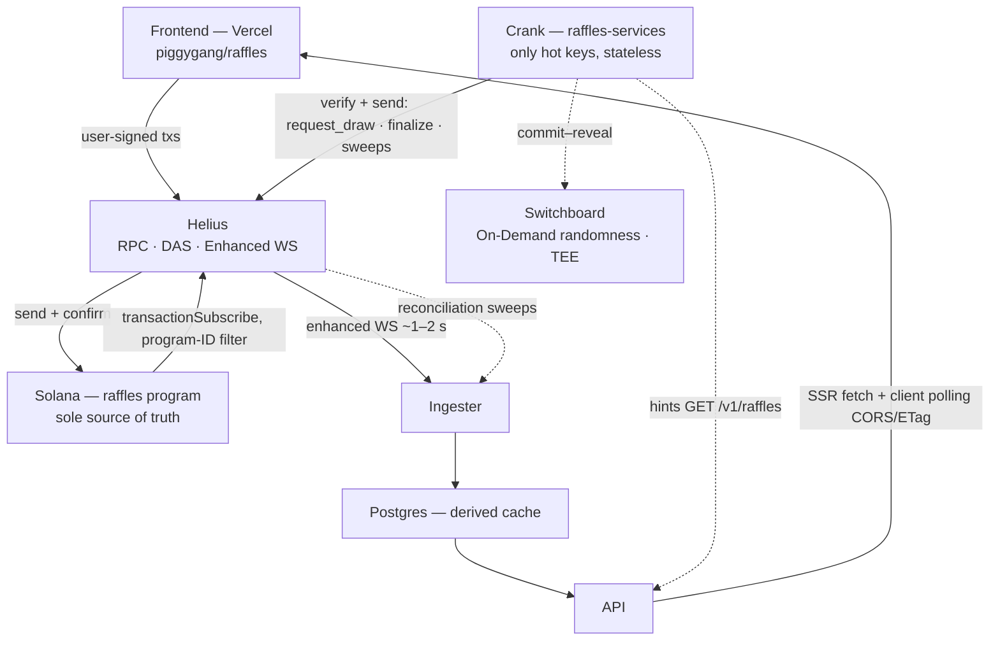
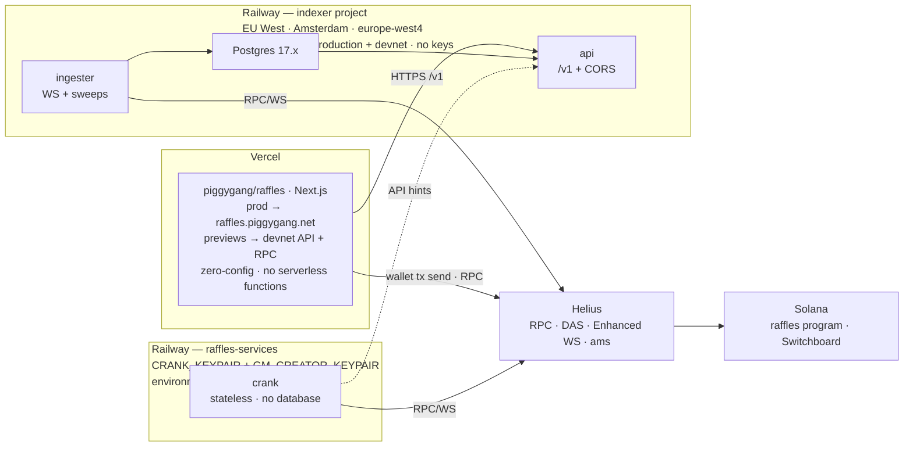

# PiggyGang Raffles — architecture

The end-to-end system behind the free holder-rewards raffles: an Anchor program as the sole source of truth, the Railway-deployed indexer as the entire read backend, a dedicated crank service holding the only hot keys, and a Next.js frontend on Vercel. Includes the written decisions on VRF, database and RPC provider.

- **Issue:** [ALG-579](https://linear.app/algolab-si/issue/ALG-579/system-architecture-and-data-flow-design-vercel-anchor-indexing)
- **Milestone:** 1 — Discovery & Architecture
- **Status:** proposed
- **Date:** 2026-08-27
- **Implements:** [spec v1.1](./piggygang-raffles-v1-spec.md) (ALG-578)

## Contents

- [§0 — Document control](#0--document-control)
- [§1 — Overview & component map](#1--overview--component-map)
- [§2 — The big picture](#2--the-big-picture)
- [§3 — Data flows](#3--data-flows)
- [§4 — Deployment topology](#4--deployment-topology)
- [§5 — API contract plan](#5--api-contract-plan)
- [§6 — Client read & write paths](#6--client-read--write-paths)
- [§7 — Decisions — VRF, database, RPC](#7--decisions--vrf-database-rpc)
- [§8 — Devnet & mainnet](#8--devnet--mainnet)
- [§9 — Rebuildability audit](#9--rebuildability-audit)
- [§10 — What this architecture supersedes](#10--what-this-architecture-supersedes)
- [§11 — Risks & open questions](#11--risks--open-questions)

## §0 — Document control

| Field | Value |
| --- | --- |
| Title | PiggyGang Raffles — system architecture & data-flow design |
| Status | `Proposed` → Accepted acceptance = ALG-579 done; the three §7 decisions are the issue's required written decisions |
| Issue | [ALG-579](https://linear.app/algolab-si/issue/ALG-579/system-architecture-and-data-flow-design-vercel-anchor-indexing) in project [PiggyGang Raffles](https://linear.app/algolab-si/project/piggygang-raffles-04d282beca26) |
| Author | Marko Sabec — ALGOLAB |
| Implements | [Feature spec v1.1](./piggygang-raffles-v1-spec.md) (ALG-578, decisions D1–D18 accepted) — product semantics are fixed there and unchanged here |
| Supersedes | The "Next.js + Rust serverless on Vercel + Vercel Cron + Helius webhooks" operational plan (§10 lists every delta) |
| Inputs | indexer decision ALG-618 (Helius Enhanced WebSockets, locked) · indexer v1 API contract (`openapi/v1.yaml`) · explorer frontend conventions · dressme wallet code |
| Changelog | `1.0 — 2026-08-27` — initial proposal `1.1 — 2026-08-27` — converted to markdown as the canonical in-repo format (the styled HTML deliverable is retired; Linear keeps the uploaded copies) |

### Design invariants

- **Invariant A** — The Solana chain is the sole source of truth. Postgres is a derived, disposable cache — rebuildable from chain, never authoritative (§9).
- **Invariant B** — No server ever sees, proxies or holds a user key or a user-signed transaction. Users sign in the browser and send straight to RPC.
- **Invariant C** — The only hot keys in the system live on one Railway service — the `raffles-services` crank — as env-only secrets, signing only their own operational transactions.
- **Invariant D** — Every lifecycle step past the deadline is permissionless on-chain. The crank is the reliable "anyone", never a required trust party — its outage degrades liveness, not correctness.

## §1 — Overview & component map

Four repos, four responsibilities. The backend is the existing `piggygang/indexer` Rust workspace on Railway — the previously planned Rust-serverless-on-Vercel application layer is retired (§10).

| Repo | Status | Owns |
| --- | --- | --- |
| **piggygang-raffles-program** `Anchor · new` | New | The program: Config, Raffle, EntryReceipt, EntryPosition, Prize Allowlist, Creator Registry PDAs; every instruction from the spec; Switchboard On-Demand integration behind a narrow provider seam. Publishes the IDL as a versioned artifact consumed by the indexer and the frontend. **All authoritative raffle state lives here.** |
| **piggygang/indexer** `Rust · Railway · extended` | Extended | The entire read backend. Workspace grows: `crates/raffles` (IDL-derived account/event decoding, PDA derivation), raffles subscription in `services/ingester` (ALG-623), raffles projections in Postgres (with `crates/data-model`, ALG-619), raffles endpoints added to `openapi/v1.yaml` and `services/api`. Stays strictly read-only — no keys, no transaction sending, exactly as designed. |
| **piggygang/raffles-services** `Rust · Railway · new` | New | The automation service: draw crank, VRF commit–reveal driver, settlement sweeps, GM raffle scheduler. Own repo, own Railway deployment, mirrors the indexer's build conventions (Dockerfile, config style, CI). The only holder of hot keys (`CRANK_KEYPAIR`, `GM_CREATOR_KEYPAIR`). Stateless — no database of its own, nothing durable (§3c). |
| **piggygang/raffles** `Next.js · Vercel · this repo` | Extended | The frontend at `raffles.piggygang.net` (already reserved in the website's app registry, accent `#3ddad7`). Explorer-style clone: vendored OpenAPI spec, generated `openapi-fetch` client, Server Components, DressMe look — plus the org's first transaction-signing wallet code, extended from dressme's `lib/wallet.ts`. |

> **Retired:** the `piggygang-raffles-application` monorepo (Next.js + Rust serverless functions on Vercel), Vercel Cron, and Helius webhooks as an ingest path. No Vercel serverless functions exist anywhere in this design; server-side compute is Railway, full stop.

## §2 — The big picture

One diagram, the whole system. Writes go down the left — a user signs in the browser and the transaction goes straight to the chain. Reads come back around the right — the program's transactions stream into the ingester, land in Postgres, and are served by the API to both server-rendered pages and polling client islands. The crank orbits the chain independently, using the API only as a hint.

*The complete data flow: the user write path (browser-signed, straight to chain), the read path (chain → ingester → Postgres → API → frontend), and the crank's operational path. Dashed edges are periodic or advisory. The Postgres box is a cache; every solid fact originates in the program box.*

## §3 — Data flows

### a — Holder claims entries

1. Server Component renders the raffle page from `GET /v1/raffles/{address}` via the server-side `API_BASE_URL` (freshness per flow g).
2. A client island connects the wallet (Wallet Standard, dressme's `lib/wallet.ts` pattern — read-only connect first).
3. The client fetches `GET /v1/wallets/{addr}/eligible-entries?raffle=…` directly from the API (CORS, §6). The response carries `asOfSlot` so the UI can label freshness. Advisory only — the program is the enforcer.
4. The client builds `claim_entries` transactions from the IDL (~6 NFT proofs per tx; a cap-10 claim is normally two), the wallet signs, and the client sends via `NEXT_PUBLIC_SOLANA_RPC_URL` (Helius, provider-restricted).
5. The confirmed transaction reaches the ingester over the WebSocket within ~1–2 s. The UI optimistically updates, then polls with `If-None-Match` until the receipts appear; on a lost race the program rejects and the UI refreshes the eligible list ("this pig was just used").

### b — Event ingestion

1. Any raffles transaction lands on-chain.
2. Helius Enhanced WebSockets delivers it: one `TransactionFilter { account_include: [RAFFLES_PROGRAM_ID] }` entry in the existing `SubscriptionSpec` — zero new ingest plumbing, live-updatable via the watch channel. The tight single-program filter keeps the 20-credits/MB budget bounded.
3. The ingester decodes instructions and Anchor events with `crates/raffles` (IDL-derived Borsh), then upserts idempotently keyed by signature: an append-only `raffle_events` log plus projections (`raffles`, `entry_receipts`, `entry_positions`, `winners`).
4. `last_processed_slot` persists only on `SlotCheckpoint`; reconnects resume inclusively → at-least-once delivery, absorbed by the idempotent upserts. All existing indexer semantics, unchanged.
5. Primary signal is `transactionSubscribe` only — no per-PDA `accountSubscribe` in v1. Account state is a fold of the event log; the snapshot sweep (flow f) catches divergence. Fewer subscriptions, fewer credits, one code path to trust.

### c — Draw lifecycle

1. The crank ticks (~30 s). Hint: `GET /v1/raffles?state=active` from the public API, filtered to `end_ts ≤ now ∧ entries ≥ 1`. If the API is down: fall back to `getProgramAccounts` with a Raffle-discriminator memcmp — raffle counts are small, chain scanning is cheap.
2. Verify before acting: `getAccountInfo` on the Raffle PDA. Already Drawing or Drawn → someone else cranked it (permissionless by design); treat as success and move on.
3. Send `request_draw` signed by `CRANK_KEYPAIR`: fresh blockhash, Helius priority-fee estimate, bounded retries with re-sign.
4. Switchboard commit–reveal: commit the randomness account, wait ~2 slots, reveal, then `fulfill_draw` + finalize — the winner is written to the Raffle PDA. The VRF fee was creator-funded at create; the crank pays only tx fees. A missed reveal window → re-commit, bounded, then alert.
5. The whole sequence flows back through flow b. **The crank writes nothing anywhere** — ingestion is the only recorder of outcomes.

### d — Sweeps & claimables

An hourly crank pass, same hint-then-verify shape: terminal raffles with open entry accounts → batched `close_entry_accounts` (many accounts per tx) then `close_raffle`, rent to each account's recorded payer, never the crank; `reclaim_prize` for zero-entry expiries, cancellations and lapsed 30-day claim windows. Funds-out paths are never blocked by the pause matrix, so sweeps run regardless of pause state.

### e — GM auto-creation

An in-process scheduler in the crank binary (daily/weekly per config — this is what replaces Vercel Cron). It signs with `GM_CREATOR_KEYPAIR` — an ordinary creator-registry member with zero special program privileges. Idempotence: a deterministic per-period tag in the create transaction, checked against both API and chain before creating; a missed period is skipped, never back-filled. Pre-flight checks prize inventory and SOL balance, and refuses to half-create.

### f — Reconciliation, backfill, cold start

| Mechanism | Cadence | What it does |
| --- | --- | --- |
| **Signature sweep** | ~10 min | `getSignaturesForAddress(program_id)` from the last checkpoint; fetch and ingest anything the WebSocket missed. The WS-gap closer. |
| **Snapshot diff** | hourly | `getProgramAccounts` with discriminator filters, diffed against projections; divergence is logged and repaired. |
| **Cold start** | on demand | Empty database → replay `getSignaturesForAddress` + `getTransaction` from the program's deploy slot → full rebuild. This is the rebuildability guarantee (§9). NFT ownership continues to come from the existing collection indexer's DAS sweeps. |

### g — Frontend reads

Split by volatility instead of fighting the org's `revalidate = 300` convention:

- **Countdowns poll nothing.** `end_ts` is immutable — SSR delivers it once, a client island ticks locally. Most of the perceived "live data" tension dissolves here.
- Archives and winners: Server Components, `revalidate = 300` as usual.
- Active raffle pages: Server Components with a per-route `revalidate = 30`.
- Live numbers (entry counts, state flips, my entries, eligible entries): client islands polling the API directly every 15–30 s with `If-None-Match` — a 304 is nearly free on both ends. Wallet-scoped data is never SSR'd; wallet identity exists only in the browser.

### h — Eligible entries

Computed entirely in `services/api` against Postgres — no chain call in the request path: the wallet's held Piggies (existing ownership tables, DAS-reconciled) minus mints with an `EntryReceipt` for this raffle, intersected with the raffle's snapshotted collections, then cap-remaining and Full-Gang-bonus preview from the wallet's `EntryPosition`. The response carries `asOfSlot`; a just-bought pig may lag until ownership catches up, but the claim transaction carries the on-chain proof — the API can only under- or over-promise the UI, never affect correctness.

## §4 — Deployment topology

Two Railway projects plus Vercel. The indexer project stays exactly what it is — read path only. The new `raffles-services` project is deliberately separate: different failure modes (a crashing transaction sender must never take down ingestion), a different secret class (keypairs exist only there), and independent pause/deploy cycles. Because the crank takes hints from the public API and verifies on-chain, it needs no database and no private networking to anything — full decoupling at the cost of nothing.

*Two Railway projects and Vercel. Keys exist only in the raffles-services project; the indexer project is read-only infrastructure; the frontend has no server-side compute beyond rendering.*

### Services

| Service | Project | Binary | Restart | Healthcheck | Postgres | Keys |
| --- | --- | --- | --- | --- | --- | --- |
| `api` | indexer | `indexer-api` | `on-failure` | `/health` | read | none |
| `ingester` | indexer | `indexer-ingester` | `ALWAYS` | none | **sole writer** | none |
| `crank` | raffles-services | `raffles-crank` | `ALWAYS` | none | none — API hints + RPC | CRANK + GM |

### Environment variables

| Scope | Variables |
| --- | --- |
| Shared concept (both projects) | `SOLANA_CLUSTER` (`devnet \| mainnet-beta`) · `RAFFLES_PROGRAM_ID` · `SOLANA_RPC_URL` · `SOLANA_WS_URL` · `RUST_LOG` — explicit URLs, not derived, so a provider swap is a config change. Parsed fail-fast (indexer `crates/config` style: missing → default, unparseable → hard error). |
| indexer project | `PORT`/`HOST` (api) · `HELIUS_API_KEY` · `DATABASE_URL=${{Postgres.DATABASE_URL}}` reference var, private networking, rustls. |
| raffles-services (crank only, secret) | **`CRANK_KEYPAIR`** — disposable ops/fee-payer key: rotate freely, hold ~0.1–0.5 SOL, balance-alerted. **`GM_CREATOR_KEYPAIR`** — creator-registry member with on-chain identity and GM prize inventory; rotation is an admin registry op. Plus `GM_SCHEDULE`, `SWITCHBOARD_QUEUE`, priority-fee knobs. Env-only, never in a repo, never on Vercel. |
| Vercel | `API_BASE_URL` (server, SSR) · `NEXT_PUBLIC_API_BASE_URL` (client polling) · `NEXT_PUBLIC_SOLANA_RPC_URL` (provider-restricted, org rule). Previews point at devnet. |

Two keys on purpose: compromise of the disposable ops key never touches the GM key's registry identity or prize inventory, and vice versa.

## §5 — API contract plan

**Extend `openapi/v1.yaml` additively** — same file, same service, new `raffles` tag. Adding endpoints is non-breaking under the frozen-v1 rule; the two-commit workflow holds and simply gains a second consumer (commit 1: indexer spec + implementation; commit 2: explorer *and* raffles re-sync via `pnpm sync:spec`, both with the spec-drift CI check). A separate spec or service was rejected: it would split the contract-of-record and buy nothing — same database, same conventions, same deploy.

All new endpoints inherit the frozen conventions: camelCase with every field required (absence = explicit `null`), cursor `PageInfo`, the `ErrorResponse` envelope, ETag + `Cache-Control`, IETF RateLimit headers, `security: []`, versioning in the server URL.

| Endpoint | Purpose | Cache |
| --- | --- | --- |
| `GET /v1/raffles?state=&cursor=` | Browse: active / ending / past, by prize collection | public, max-age=15 + ETag |
| `GET /v1/raffles/{address}` | Detail: prize, counts, state, winner, VRF proof link, `asOfSlot` | public, max-age=5 + ETag |
| `GET /v1/raffles/{address}/entries?cursor=` | Entry positions and ranges (draw verification) | public, max-age=15 + ETag |
| `GET /v1/winners?cursor=` | History: prize, winner, entries, proof — the transparency page | public, max-age=300 + ETag |
| `GET /v1/wallets/{address}/raffle-entries?cursor=` | My entries across raffles, odds, claimables, closeable rent | private, max-age=5 |
| `GET /v1/wallets/{address}/eligible-entries?raffle=` | Flow h — eligible mints, cap remaining, bonus preview, `asOfSlot` | private, no-store |
| `GET /v1/raffles-config` | Prize Allowlist, Creator Registry, config snapshot values, pause state | public, max-age=60 + ETag |

Wallet-scoped but public and read-only is fine: every byte is derivable from public chain data by anyone with an RPC. The obligations are correct cache directives (`private`/`no-store` — no shared-cache poisoning) and rate limiting (§11), not auth.

## §6 — Client read & write paths

### Reads — direct to the API, with CORS

Wire `actix-cors` (already version-pinned in the indexer for exactly this milestone, ALG-625) with an origin allowlist — `raffles.piggygang.net`, the explorer domain, localhost — and let client islands poll `/v1` directly via `NEXT_PUBLIC_API_BASE_URL`. Server Components keep the server-side `API_BASE_URL` for SSR. Same URL; it stops being a secret, which was always a deployment convenience, not a security property, for a `security: []` API.

Why direct beats a Next route-handler proxy: a proxy funnels every client through Vercel egress IPs, collapsing the contracted per-client RateLimit semantics into one bucket — disqualifying on its own; it also costs a function invocation per poll tick and adds a hop, where direct polling with ETags costs the API a 304.

### Writes — browser-signed, straight to chain

The dressme wallet pattern, extended to signing: the client builds transactions from the IDL, the wallet signs via Wallet Standard, the client sends via `NEXT_PUBLIC_SOLANA_RPC_URL` (Helius, domain-restricted and rate-limited at the provider). **Neither Vercel nor Railway ever sees, proxies or holds a user key or a user-signed transaction** (Invariant B). The only server-held keys are the crank's, signing only its own operational transactions (Invariant C).

## §7 — Decisions — VRF, database, RPC

The three written decisions ALG-579 requires. Each records the decision, the comparison it rests on, and the condition that would reopen it.

### ADR-1 · VRF — Switchboard On-Demand — **decided**

|  | Switchboard On-Demand | ORAO |
| --- | --- | --- |
| Cost | ~0.002 SOL/request (historical figure; re-verify at integration) | ~0.001 SOL base + request-account rent |
| Model | TEE-attested randomness, commit–reveal, ~2 slots | Oracle network, request/callback |
| Integration | Active Anchor SDK; needs a crank to commit + reveal | Simple Rust SDK; callback fits crankless designs |
| Fit here | The crank exists by construction — the burden is already paid | Callback advantage is moot for us |
| Ecosystem | Broad Solana adoption, audited, actively maintained | Smaller footprint |

**Decision:** Switchboard On-Demand — formalizing accepted spec decision D3. **Why:** the stronger security model (TEE attestation vs trusting a smaller operator set) for the one component whose only job is unbiasable winner selection; the commit–reveal crank burden lands on a service that must exist anyway for draws and sweeps; the ~0.001 SOL delta is noise against a creator-funded fee. The program keeps the provider seam narrow — `fulfill_draw` verifies a provider-specific proof account — so ORAO stays a real fallback, and the crank drives providers behind a trait. **Revisit if:** Switchboard's devnet queues prove unreliable for ALG-602 E2E (validate in week one — §11), fees change materially, or the on-demand service is deprecated.

### ADR-2 · Database — Railway Postgres — **decided**

|  | Railway Postgres | Neon | Supabase |
| --- | --- | --- | --- |
| Locality | Same project/region as ingester + api, private networking, zero egress | Cross-cloud hop + egress | Cross-cloud hop, public pooler |
| Durability | Snapshots, not PITR | PITR | PITR |
| Extras | None — none needed | Branching (nice, unneeded) | Auth/realtime/storage — nobody needs these: the API is the realtime layer and there is no auth |
| Ops | Reference vars, one bill, docker-compose parity (PG 17.x) | Second vendor | Second vendor |

**Decision:** Railway Postgres — the database the indexer already plans, unchanged by raffles. **Why:** the database is a derived cache; the snapshots-not-PITR caveat is already accepted in the indexer docs and §9 preserves the chain-rebuildability that justifies it, so PITR buys nothing. Colocation with the write and read paths plus single-vendor ops beat features designed for databases that are sources of truth. **Revisit if:** rebuild-from-chain time grows past an acceptable outage window, or read load demands replicas Railway can't provide.

### ADR-3 · RPC & ingest provider — Helius — **decided**

|  | Helius (Developer, $49/mo) | Triton |
| --- | --- | --- |
| Streaming | Enhanced WebSockets (`transactionSubscribe`); LaserStream gRPC on Business behind the same `IngestSource` trait | Yellowstone gRPC — excellent, but a new adapter at a higher entry price |
| NFT data | DAS — independently mandatory for holder eligibility + reconciliation | No DAS equivalent; a second provider would still be needed |
| Region | ams endpoints — the Railway region was chosen for them | Varies |
| Budget | 10M credits/mo; WS 20 credits/MB; DAS 10/call — tight filters are policy | Different model |
| Status | Locked by indexer decision ALG-618; webhooks explicitly demoted ("never a source of truth") | — |

**Decision:** Helius, unchanged — formalizing locked ALG-618 for the raffles context. Raffles adds one tight program-ID subscription and modest sweep traffic to an already-budgeted plan. **Why:** DAS is independently mandatory, the region already matches, and splitting providers doubles ops for no gain. **Revisit if:** credit metering (§11) shows raffles pushing past the 10M budget — the relief valve is the pre-planned Business-plan LaserStream, an adapter swap behind the existing trait, not an architecture change.

## §8 — Devnet & mainnet

The indexer has no cluster concept today; raffles introduces one as **config, not code**: `SOLANA_CLUSTER`, `RAFFLES_PROGRAM_ID`, `SOLANA_RPC_URL`, `SOLANA_WS_URL` — fail-fast parsed, threaded through all services.

- **Two Railway environments per project** (`production` = mainnet, `devnet`), each with its own Postgres (indexer project) and its own variables — same code, same config files, only values differ (devnet program ID, devnet keys with airdropped SOL, same Helius key). A separate Railway project per cluster was rejected (duplicated setup, no extra isolation); a single deployment with env-var switching was rejected (a mainnet ingester can't also watch devnet, and E2E must never touch production Postgres).
- **Development ladder:** Anchor localnet with a mocked randomness account for program tests → devnet with real Switchboard On-Demand for the full loop → ALG-602 E2E against the devnet Railway environment: seed registry → create → claim → short-duration end → crank draws → assert winner via `GET /v1/raffles/{address}` → sweep closes → assert rent returned.
- **Frontend:** Vercel previews point `NEXT_PUBLIC_API_BASE_URL` + `NEXT_PUBLIC_SOLANA_RPC_URL` at devnet; production points at mainnet.
- **Ordering constraint:** the cluster-config refactor lands in `crates/config` before the ingester's raffles subscription and before the devnet environment is provisioned. The mainnet Railway domain is still unprovisioned (`REPLACE-ME.up.railway.app` in the contract) — provisioning blocks the CORS allowlist and the frontend env setup.

## §9 — Rebuildability audit

The indexer's founding property — "the entire DB is rebuildable from chain" — justifies its snapshot-only backups and must survive raffles. Every piece of raffles state, and where it is authoritative:

| State | Authoritative source | Postgres role |
| --- | --- | --- |
| Raffle config, state, timestamps, winner, prize | Raffle PDA + escrow ATA | derived projection |
| Entries, ranges, bitmask, bonus, rent payer | EntryReceipt / EntryPosition PDAs | derived projection |
| Allowlist, registry, config values, pause | Config / Allowlist / Registry PDAs | derived mirror |
| NFT ownership (eligibility input) | Chain, via DAS | derived (existing indexer) |
| Raffle title / short description | **Must ride in `create_raffle` instruction data** (or the Raffle PDA) — flag 1 below | derived |
| Rules content behind `rules_uri` | Off-chain document — flag 2 below | cache only |
| Ingest checkpoint | Operational only, resettable | — |
| Crank bookkeeping | None — the crank is stateless by design | — |

> **Flag 1 — title/description:** if these existed only as rows typed into Postgres, rebuildability dies and the API becomes a second source of truth. Requirement for the program team (feeds ALG-585): carry the short title (and a description or its hash) in the `create_raffle` instruction data — instruction data lands in the replayable transaction log, which is enough. Postgres stays a pure fold of chain data.

> **Flag 2 — rules content:** the URI string is on-chain but the document behind it is mutable. Requirement: content-address it — an Arweave/IPFS URI or an on-chain content hash alongside the URI — so the published rules (a legal artifact, spec Invariant 2) are tamper-evident.

**The honest nuance:** after settlement, `close_entry_accounts`/`close_raffle` reclaim rent and the PDAs cease to exist. For closed raffles, rebuildability rests on the *transaction log*, not account state: authoritative for live state = accounts; authoritative for history = archival replay (flow f cold start). That depends on archival `getSignaturesForAddress`/`getTransaction` coverage for the program ID (§11). Belt and braces: a periodic logical dump of the append-only `raffle_events` table is cheap insurance that never becomes a source of truth — replay always wins on conflict.

## §10 — What this architecture supersedes

Deltas against the project description and the signed spec's operational assumptions. Product semantics (spec D1–D18) are untouched; in each row below, **this document wins** and the source doc should be updated in follow-up.

| Where | Was | Now |
| --- | --- | --- |
| Project description | Rust serverless functions on Vercel | Rust services in the `indexer` Railway project (api, ingester) + `raffles-services` (crank) |
| Project description | Vercel Cron for lifecycle automation | The crank's internal scheduler (draw loop, sweeps, GM cadence) |
| Project description · spec §6 | Helius webhooks → ingest | Helius Enhanced WebSockets + reconciliation sweeps, per locked ALG-618 (webhooks: "3-retries-then-lost — never a source of truth") |
| Spec §3 actor table | Crank = "Vercel Cron or anyone" | Crank = "`raffles-services` or anyone" — the permissionless property, the load-bearing part, is preserved verbatim |
| Repo plan (ALG-591) | `piggygang-raffles-application` monorepo (Next.js + Rust on Vercel) | Retired. Frontend = this repo; backend = indexer; automation = raffles-services; program = piggygang-raffles-program |
| Backend issues (ALG-592, ALG-595) | Webhook indexer · Vercel Cron jobs | Re-scope to ingester subscription + crank service; the *what* (idempotent indexing, auto-draw, retries, sweeps, alerting) is unchanged, the *where* moves |
| Reaffirmed | raffles.piggygang.net · the signed spec's program design and D1–D18 (Switchboard per D3) · frozen v1 API conventions · the read-only, no-keys indexer philosophy — now protected structurally by putting the crank in its own repo | |

## §11 — Risks & open questions

| # | Risk | Mitigation / action |
| --- | --- | --- |
| R1 | WebSocket gaps during ingester downtime → stale reads | Checkpoint resume + 10-min signature sweep close the gap; `asOfSlot` makes lag visible instead of silent. Quantify max acceptable staleness for the UI. |
| R2 | Helius credit budget — claims are bursty on popular drops | Per-source credit metering from day one; tight filters are already policy; Business-plan LaserStream is the pre-planned relief valve (ADR-3). |
| R3 | Closed-raffle history depends on archival transaction coverage | Verify Developer-plan archival `getSignaturesForAddress` depth for the program ID; hedge with the `raffle_events` dump (§9) — replay wins on conflict. |
| R4 | Crank key ops: drained fee payer, runaway retries | Balance alerts on both keys; a retry circuit breaker so a bug can't burn the ops key on priority fees; GM pre-flight checks inventory + SOL and refuses to half-create. |
| R5 | Switchboard on devnet unproven for us | Validate queue availability + reveal latency in week one of program development — it is ADR-1's revisit trigger, and late discovery stalls ALG-602. |
| R6 | Public API abuse once CORS opens — wallet-scoped endpoints are uncacheable and JOIN-heavy | Per-IP rate limiting in actix honoring the contracted RateLimit headers; keep eligible-entries queries indexed and cheap; optionally front public-cacheable routes with a CDN. |
| R7 | Reveal window under congestion — missed reveals cost re-commits | Priority-fee strategy with a congestion mode; monitor reveal-success rate. |
| R8 | "I just bought this pig, why can't I enter?" — API lag vs chain truth | `asOfSlot` labeling, UI copy, and an on-chain fallback check when a claim fails eligibility the API predicted. |
| R9 | ~6 proofs/tx is an estimate — compute limits may move it | Coordinate with the program team early; UI batching and the eligible-entries response shape (pre-chunked account triples) depend on it. |
| R10 | Ordering: cluster config, domains, CORS | Land `SOLANA_CLUSTER` config before the raffles subscription and devnet environment; provision the Railway domain (still `REPLACE-ME`) before CORS allowlists and frontend envs. |
| R11 | Permissionless races — crank vs public callers | Benign by design: a lost race is a cheap failed tx; crank treats "already done" as success, not failure. |
