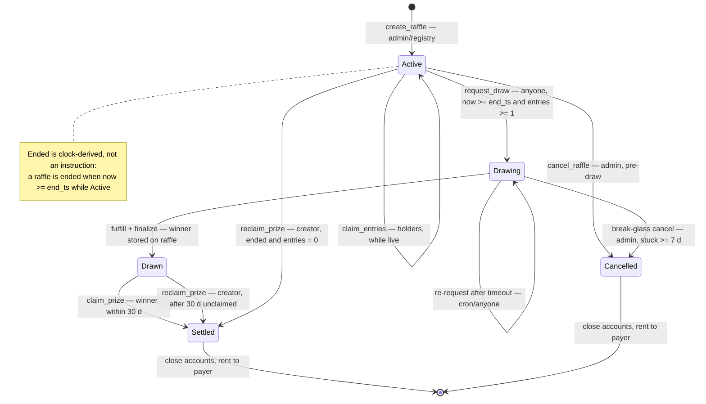
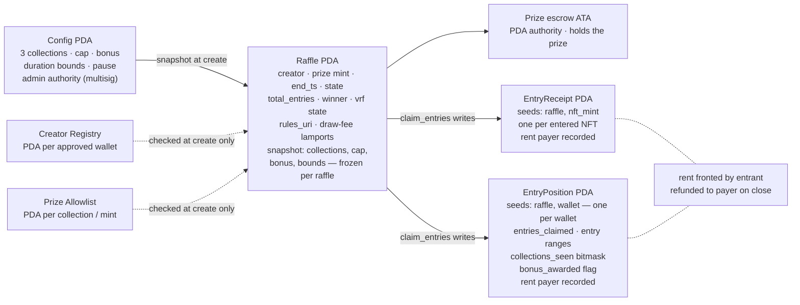

# PiggyGang Raffles v1 — the free holder-rewards model

On-chain raffles for holders of the three Piggy collections. Free entries, capped per wallet, Full Gang bonus, provably fair VRF draws — and nobody ever pays to enter. This document is the canonical behavioural spec the program, backend and frontend are built against.

- issue **ALG-578**
- milestone **1 — Discovery & Architecture**
- version **1.2-review**
- date **2026-08-27**
- target **raffles.piggygang.net**

## Contents

- [§0 — Document control](#0--document-control)
- [§1 — Overview & goals](#1--overview--goals)
- [§2 — Legal grounding — why free is load-bearing](#2--legal-grounding--why-free-is-load-bearing)
- [§3 — Actors & roles](#3--actors--roles)
- [§4 — Raffle types](#4--raffle-types)
- [§5 — Entry policy](#5--entry-policy)
- [§6 — Holder verification](#6--holder-verification)
- [§7 — Lifecycle & state machine](#7--lifecycle--state-machine)
- [§8 — Draw fairness & VRF](#8--draw-fairness--vrf)
- [§9 — Settlement, rent & account closing](#9--settlement-rent--account-closing)
- [§10 — Registries, config & admin](#10--registries-config--admin)
- [§11 — Edge cases & failure modes](#11--edge-cases--failure-modes)
- [§12 — UX surface](#12--ux-surface)
- [§13 — Out of scope for v1](#13--out-of-scope-for-v1)
- [§14 — Decisions](#14--decisions)
- [§15 — Glossary](#15--glossary)
- [§16 — Sign-off](#16--sign-off)

## §0 — Document control

| Field | Value |
| --- | --- |
| Title | PiggyGang Raffles v1 — feature spec, free holder-rewards model |
| Status | Draft → `In review` → Signed off — decisions D1–D18 accepted; role sign-offs pending, see §16 |
| Issue | [ALG-578](https://linear.app/algolab-si/issue/ALG-578/feature-spec-piggygang-raffles-v1-free-holder-rewards-model) in project [PiggyGang Raffles](https://linear.app/algolab-si/project/piggygang-raffles-04d282beca26) |
| Author | Marko Sabec — ALGOLAB |
| Sources | Project brief; compliance review ALG-582 (done); design issues ALG-579–581, ALG-584–589, ALG-592–601, ALG-607 |
| Changelog | `1.2 — 2026-08-27` — converted to markdown as the canonical in-repo format (the styled HTML deliverable is retired; Linear keeps the uploaded copies) `1.1-review — 2026-08-27` — D1–D18 accepted as proposed by the project lead; markers flipped to decided `1.0-draft — 2026-08-27` — initial complete draft for review |

**What this document is authoritative for:** behaviour — entry rules, lifecycle states and transitions, edge-case outcomes, admin semantics, and the legal invariants. Where an implementation issue disagrees with this spec, the spec wins and the issue gets updated (§16 lists the known updates).

**What it defers:** exact account layouts and byte-level fields (ALG-584), API shapes (ALG-593), infrastructure and data flow (ALG-579 — see [the architecture doc](./piggygang-raffles-architecture.md)), visual design of the app (ALG-596 — aligned with the DressMe look, as is this document).

Decision points are marked **decided** inline and collected in §14 — all eighteen were accepted as proposed on 2026-08-27. Changing one now means a spec revision, not a review note.

## §1 — Overview & goals

PiggyGang Raffles is an on-chain raffle platform for the PiggyGang ecosystem, inspired by the Famous Foxes raffle house but re-scoped to a **free-entry model** after compliance review. Holders of the three Piggy collections claim free entries into raffles funded by the DAO and approved partners; a VRF draw picks the winner; the proof is public; the only thing an entrant ever spends is network gas — and the account rent they front comes back.

- **Goal:** Reward holders — holding a Piggy earns free chances at real prizes, and holding all three collections earns more.
- **Goal:** Give the DAO and partners a trusted giveaway rail with escrowed prizes and provable draws — no more trust-me spreadsheet raffles.
- **Goal:** Drive Full Gang collecting and the Piggy Gang Core migration through the bonus mechanic.
- **Goal:** Stay a free promotional prize game — outside gambling regulation, by construction (§2).

### Non-goals for v1

- Payments of any kind — no tickets, fees, burn-to-enter or buyable entries (§2, §13).
- Open raffle creation — creation is restricted to the DAO admin and the creator registry (§10).
- Proportional entries for big holders (Merkle snapshot mode) — deferred to v2, ALG-607.
- Multi-winner raffles, delegate/vault claiming, leaderboard — v1.1 candidates (§13).

### Success criteria

- Live on `raffles.piggygang.net` around Sept 15, 2026, open-source, with the winners page up from day one.
- A GM raffle cadence running unattended on cron, and at least one DAO Drop and one partner giveaway completed end-to-end on mainnet.
- Zero instances of an entrant paying anything beyond gas; all settled raffles fully rent-refunded.

## §2 — Legal grounding — why free is load-bearing

A raffle with paid tickets is legally a lottery — consideration + chance + prize — and requires gambling licensing (the reference platform operates through a licensed Costa Rica gaming entity). Slovenia's Games of Chance Act reserves games of chance for state concession holders, but **explicitly excludes free promotional prize games** (*nagradna igra*). The compliance review (ALG-582) concluded: still raffles, still provably fair, but nobody ever pays to enter. That single decision shapes most of this spec.

### The three invariants

- **Invariant 1 — no consideration, ever.** No entry may cost anything beyond network gas. Account rent an entrant fronts is temporary only if it reliably comes back — so rent refunds (§9) are a legal mechanism, not a nicety, and no code path may strand them.
- **Invariant 2 — published rules per raffle.** Every raffle carries published rules (organizer, duration, prize, how winners are drawn). Enforced structurally: `create_raffle` requires a `rules_uri` and the app renders a rules page per raffle (§12).
- **Invariant 3 — 18+ and prize taxes.** The app shows an 18+ note; prize-tax duties sit with the DAO and are handled off-chain (§14, D17). No personal data goes on-chain.

> **Guard-rail:** any future feature that touches these invariants — "premium entries", sponsored boosts, anything where value flows from an entrant — requires a new legal review before a line of code is written.

### What a raffle costs an entrant

| Cost | Amount | Notes |
| --- | --- | --- |
| **Network gas** | `~0.0001 SOL/tx` | Paid to the network, not to us. One or two transactions per raffle for most wallets. |
| **Account rent** | `fronted → returned` | Entrants front rent for their entry accounts and get it back after settlement — every path leads to a refund (§9). |
| **Entry price** | **Free** | No tickets, no fees, no burns, no buyable entries. Free stays free — it is what keeps this legal. |

## §3 — Actors & roles

Creation is restricted; progression is permissionless. The cron is a convenience layer — every post-end step (`request_draw`, finalize, account closing) can be cranked by anyone, so a Vercel outage can delay a draw but never block one.

| Actor | Can do | Signs | Trust assumptions |
| --- | --- | --- | --- |
| **DAO admin** — Squads multisig | Config updates, registries, pause, cancel, break-glass; also a regular creator | `init_config` · `update_config` · `whitelist_*` · `creator_*` · `cancel_raffle` · `set_authority` | Trusted for ops, but can never redirect a prize or block funds-out paths (§10 pause matrix) |
| **Approved partner** — creator registry member | Create raffles with allowlisted prizes; reclaim own prize on zero entries / expiry | `create_raffle` · `reclaim_prize` · `close_raffle` | Vetted off-chain before registry add; cannot enter own raffles (E-E12) |
| **Holder / entrant** | Claim free entries with owned Piggies; close own entry accounts | `claim_entries` · `close_entry_accounts` | Untrusted — every claim is verified on-chain per NFT (§6) |
| **Winner** | Withdraw the escrowed prize | `claim_prize` | Must sign with the recorded winning wallet; no admin override (E-S2) |
| **Crank** — Vercel Cron or anyone | Trigger draws, retry VRF, sweep closeable accounts | `request_draw` · finalize · `close_entry_accounts` | Permissionless by design; crank wallet holds only small SOL for fees |
| **GM bot** — automation key | Create scheduled GM raffles | `create_raffle` | An ordinary creator-registry member — no special program path; blast radius capped by its funding and the prize allowlist (D7) |
| **VRF provider** — Switchboard On-Demand **decided** | Deliver verifiable randomness for draws | `fulfill_draw` callback | Trusted for liveness only — the proof is publicly verifiable, and a dead provider has a break-glass path (E-D5) |

## §4 — Raffle types

Four types, one mechanism. Types are presets over the same lifecycle — they differ in who creates, where the prize comes from, typical duration and the per-raffle entry cap. There are no type-specific code paths in the program; the type is a label the app uses for presentation and defaults.

| Type | Creator | Prize source | Typical duration | Cadence | Entry cap |
| --- | --- | --- | --- | --- | --- |
| **DAO Drop** — flagship treasury raffles | DAO admin | Treasury-funded NFTs or SPL prizes | 3–7 d | Occasional | 10 (default) |
| **Partner giveaway** — projects reaching the community | Approved partner | Partner-donated, allowlisted prize | 2–7 d | As partnered | 10 (default) |
| **GM raffle** — daily/weekly micro-prizes | GM bot | Small allowlisted prizes, pre-funded | 24 h / 7 d | Cron-created | 1 — one entry per holder — the streak ritual |
| **DressMe crossover** — dress your pig → win | DAO admin | Escrowed voucher NFT redeemable in DressMe **decided** | 3–7 d | Campaigns | 10 (default) |

The DressMe crossover stays label-level in v1: the prize is a real escrowed voucher NFT, so the "no raffle without an escrowed prize" invariant holds unconditionally. Live DressMe integration (entries earned by dressing) is a v1.1 candidate (D8).

## §5 — Entry policy

### Eligibility

A wallet is eligible if it holds at least one NFT with *verified* collection membership in any of the three Piggy collections:

- `Piggy SOL Gang · 10,000 · SPL`
- `Piggy Girl Gang · 5,000 · SPL`
- `Piggy Gang · 10,000 · Metaplex Core`

### Entry math

- **+1 entry per Piggy** entered, up to the per-wallet cap of **10** **decided** per raffle (D1). The cap tames whales and keeps claims within Solana transaction limits.
- **Full Gang bonus: +3 entries** **decided** for having entered at least one Piggy from each of the three collections in this raffle — awarded once per wallet per raffle (D2).
- **The bonus sits on top of the cap.** The cap applies to per-NFT entries only; maximum total per wallet is cap + bonus = `13`. *(Resolves R1 — the issues left the cap–bonus relationship unstated.)*
- **Cap counts entries claimed, not NFTs owned.** A wallet holding pigs that were already used by a previous owner (E-E2) loses nothing from its own allowance.

> **Bonus at the cap:** a wallet already at 10 per-NFT entries can still submit one NFT from a missing collection to complete the Full Gang set. The completing NFT earns +0 per-NFT entries (cap) but still triggers the +3 bonus, and its `EntryReceipt` is created as usual. This must hold or capped whales could never earn the bonus (E-E16).

### One NFT, one use per raffle

- Each NFT is usable once per raffle, enforced by an `EntryReceipt` PDA at seeds `[raffle, nft_mint]` — creating it a second time fails. This blocks transfer-and-reclaim: selling a pig after entering does not free it up for the buyer *in that raffle*.
- Entries are **snapshot-at-claim**: once claimed they stand, attributed to the claiming wallet, even if the NFT is later sold, listed or burned (E-E8). The winner is the claiming wallet.
- The same NFT is independently usable in every concurrent raffle — receipts are per-raffle.

### Batching

- Each `claim_entries` transaction proves ~6 NFTs (mint + token account + metadata per NFT within account limits). A cap-10 claim is normally two transactions; this is normal operation, and no UI copy promises one-click-one-tx (R15).
- Partial progress is valid state: if transaction 2 of 2 fails, the first 6 entries stand and the app resumes with "claim remaining 4" (E-I3).
- The bonus works across batches: per-wallet state tracks which collections have been entered and whether the bonus was awarded, so the claim that completes the set triggers it — exactly once, regardless of transaction count (E-E7, R4).
- For wallets holding more than the cap, the eligible-entries service selects deterministically — first N eligible NFTs in mint-address order (D18). Economically identical, reproducible for support and retries.

### Worked examples (cap 10, bonus +3)

| Wallet holds | Per-NFT | Bonus | Total | Txs | Note |
| --- | ---: | ---: | ---: | ---: | --- |
| 3 SOL Gang | 3 | 0 | 3 | 1 | Simple case |
| 200 Piggy Gang | 10 | 0 | 10 | 2 | Whale capped; service picks first 10 by mint order |
| 4 SOL + 3 Girl + 2 Gang | 9 | 3 | 12 | 2 | Full Gang under cap |
| 120 SOL + 40 Girl + 40 Gang | 10 | 3 | 13 | 2 | Maximum possible per wallet |
| 10 SOL entered, then buys 1 Girl + 1 Gang | 10 | 3 | 13 | 3 | Completing NFTs accepted at cap for the bonus (E-E16) |
| 10 pigs, 3 already used by seller | 7 | 0 | 7 | 2 | Used pigs filtered out; own allowance intact (E-E2) |

## §6 — Holder verification

Two layers with a clear division of authority: **the chain decides, the service assists.**

- **On-chain — authoritative.** Inside `claim_entries`, per NFT: the token account (or Core asset) is owned by the signer with amount 1, not escrowed elsewhere, and the metadata carries a *verified* collection membership in one of the three collection addresses snapshotted on the raffle. Anything else fails the whole instruction.
- **Off-chain — convenience.** The eligible-entries service (ALG-594) answers `GET /wallets/:address/eligible-entries?raffle=:id`: DAS holdings filtered to the three collections, minus mints whose `EntryReceipt` already exists, up to the remaining allowance — returning the exact account triples for the claim transactions plus Full Gang status.

### What does not count

- NFTs listed on a marketplace or otherwise escrowed/delegated — the wallet no longer holds them (same rule and same user-facing wording as DressMe's wallet view).
- Unverified collection metadata and lookalikes — the verified-collection flag is mandatory; DAS spam is filtered by the service and rejected by the program as backstop.
- Holdings in a different wallet (vaults, cold storage) — v1 entries are bound to the signing wallet; delegate claiming is deferred (D12).

The index can lag the chain (webhook ingest); the app labels derived numbers as approximate and always rebuilds claim transactions from chain-consistent data. Races lose cleanly: a receipt that already exists fails that claim with a friendly "this pig was just used" (E-E3, E-I1).

## §7 — Lifecycle & state machine

The happy path, end to end:

`create + escrow → live → end_ts → VRF draw → winner claims → close accounts (rent back)`

### States

`Active` · `Ended — clock-derived` · `Drawing` · `Drawn` · `Settled` (terminal) · `Cancelled` (terminal)

**"Ended" is not an instruction transition** — no `end_raffle` exists. A raffle is ended when `now ≥ end_ts` while Active; the program gates on the clock and the indexer derives the phase from `end_ts` (resolves R8). Terminal states are Settled and Cancelled; both unlock account closing.

*Every path terminates in Settled or Cancelled, and both unlock account closing — no raffle can strand entrant rent. Solid edges are the happy path; the retry loop, break-glass cancel and expiry reclaims are the fallbacks.*

### Transition table

| From → To | Instruction | Caller | Guard |
| --- | --- | --- | --- |
| — → Active | `create_raffle` | admin / registry creator | Prize on allowlist · escrow funded atomically · duration within bounds · `rules_uri` present · draw fee funded (R14) · not paused |
| Active → Active | `claim_entries` | holder | now < end_ts · signer ≠ creator · per-NFT proofs pass · cap respected · not paused |
| Active → Drawing | `request_draw` | anyone | now ≥ end_ts · total_entries ≥ 1 · not paused |
| Drawing → Drawing | `request_draw` (re-request) | anyone | retry timeout elapsed since last request (E-D4) |
| Drawing → Drawn | `fulfill_draw` + finalize | VRF · anyone | randomness delivered · supplied EntryPosition range contains winner_index · winner pubkey stored (R18) |
| Drawn → Settled | `claim_prize` | winner | signer = stored winner · within 30 d claim window **decided** |
| Drawn → Settled | `reclaim_prize` | creator | claim window expired (E-S1) |
| Active → Settled | `reclaim_prize` | creator | now ≥ end_ts · total_entries = 0 (E-D1) |
| Active → Cancelled | `cancel_raffle` | admin | before request_draw · reason recorded (E-A1) |
| Drawing → Cancelled | `cancel_raffle` (break-glass) | admin | ≥ 7 d stuck in Drawing **decided** (E-D5) |
| Cancelled → — | `reclaim_prize` | creator | prize returns to creator; state stays Cancelled |
| terminal → — | `close_entry_accounts` · `close_raffle` | anyone · creator/anyone | state ∈ {Settled, Cancelled} · rent → recorded payer (§9) |

`request_draw` and zero-entry `reclaim_prize` are mutually exclusive by entry count — ≥ 1 entry draws, 0 entries reclaims; there is no state where both or neither apply (R17). Time is cluster time: the program gates on the on-chain clock, UI countdowns are advisory and stop offering entry ~30 s before `end_ts` (E-I4).

### Timeline

| Phase | Window | Notes |
| --- | --- | --- |
| create | raffle opens | Escrow funded atomically with creation |
| live — `claim_entries` | create → `end_ts`; duration bounds 1 h – 30 d | Holders claim free entries while the raffle is live |
| `end_ts` | instant marker | Claiming closes (UI stops offering entry ~30 s early); draw becomes available |
| draw + retries | `end_ts` → drawn | `request_draw`, then VRF retry ticks until fulfilled |
| drawn | instant marker | Winner stored on the raffle; claim window opens |
| claim window | 30 d from Drawn | Winner may `claim_prize` |
| claim expiry → creator reclaim | after 30 d unclaimed | Creator may `reclaim_prize` |
| close + rent sweep | open from settlement onward | `close_entry_accounts` + `close_raffle`; rent to recorded payers |

*Every timer on one line: duration bounds 1 h–30 d, VRF retry ticks inside the draw window, the 30-day claim window, then creator reclaim. Values decided — see D4, D5.*

### Account model — what the states live on

*One `EntryPosition` per wallet per raffle (seeds `[raffle, wallet]`) carries the cap counter, the collections-seen bitmask and the bonus flag — this is what makes "bonus once per wallet" safe across batched claims (resolves R4). Byte-level layout belongs to ALG-584.*

## §8 — Draw fairness & VRF

- **Request.** `request_draw` is permissionless once `now ≥ end_ts` with ≥ 1 entry. It requests randomness from the VRF provider — Switchboard On-Demand **decided**, ORAO as the evaluated fallback (D3) — and moves the raffle to Drawing.
- **Fee.** The VRF request fee is deposited by the creator at `create_raffle` into the raffle (draw-fee lamports), so cranking is never a losing trade and entrants never touch it — free stays free (resolves R14). Unused fee returns to the creator at `close_raffle`.
- **Fulfill.** The provider delivers randomness; `winner_index = randomness % total_entries`. Modulo bias is negligible and accepted — u64 randomness against at most tens of thousands of entries biases below 2⁻⁴⁰, documented on the fairness page (E-D8).
- **Finalize.** A permissionless finalize step passes the `EntryPosition` whose entry range contains `winner_index`; the program verifies the range and the raffle it belongs to, then stores the position's wallet as `winner` on the Raffle PDA. Wrong accounts fail constraints; the right account is deterministically findable from the index (E-D6, R18).
- **Retry.** If fulfillment doesn't arrive within the retry timeout, `request_draw` may re-request; the cron does this automatically and escalates to an alert after repeated failures (ALG-595). Every request is visible on-chain.
- **Verifiability.** The winners page links the VRF proof and the draw transaction per raffle; anyone can recompute `winner_index` from the public randomness and `total_entries`. "Provably fair" is a checkable claim, not a slogan.

## §9 — Settlement, rent & account closing

No proceeds, no fees — settlement here means prizes out and rent back. The rent rules are Invariant 1 wearing its engineering hat.

### Rent flow

- Entrants front the rent for their `EntryReceipt` and `EntryPosition` accounts at claim time; each account records its payer.
- `close_entry_accounts` is permissionless but gated to `state ∈ {Settled, Cancelled}`. Lamports always return to the **recorded payer, never the cranker** — early or redirected closes fail; correct cranking is a public good the cron performs (resolves R3, E-S6).
- The cron sweeps closeable accounts after settlement so entrants get rent back without lifting a finger; `/me` also offers a manual reclaim (E-S7).

> **The critical gate (R2):** every raffle must reach a terminal state in bounded time, or rent is stranded and the free model breaks. Settled is reachable three ways — winner claims, creator reclaims after zero entries, creator reclaims after claim expiry. Backstop: if the creator also never acts, entry accounts become closeable anyway once `claim expiry + 30 d grace` **decided** has passed. There is no path that leaves entrant rent locked.

### Prize settlement

- `claim_prize` — the stored winner withdraws the escrowed prize to an ATA of the winning wallet (destination = signer only; transfer it onward afterwards if needed, E-S5). State → Settled atomically with the transfer.
- `reclaim_prize` — the creator recovers the prize after zero-entry expiry, after an admin cancel, or after the claim window expires unclaimed. No redraw in v1 (D5).

### Raffle-level closing

`close_raffle` — after the raffle is terminal, the Raffle PDA, escrow ATA and unused draw-fee lamports close with rent to the creator. *This instruction was missing from the original instruction inventory; this spec adds it (G1) — ALG-588/589 to be updated.*

### Who pays what

| Cost | Paid by | Comes back? | When |
| --- | --- | --- | --- |
| Prize + its escrow rent | creator | Prize to winner; rent yes | Escrow rent at `close_raffle` |
| VRF draw fee | creator | Unused portion yes | At `close_raffle` |
| Entry account rent | entrant | Always — to the recorded payer | At `close_entry_accounts`, post-settlement |
| Network gas | whoever signs | No — network cost, ~0.0001 SOL/tx | Disclosed in the UI; the only unrecoverable cost |
| Crank gas | crank wallet | No — ops budget | Small SOL balance, monitored |

## §10 — Registries, config & admin

Two registries, canonically named to stop the "whitelist" ambiguity in earlier issue text (R11): the **Prize Allowlist** (which collections and individual mints may be prizes — keeps junk and scam prizes out of partner giveaways) and the **Creator Registry** (which wallets may create raffles). The payment-token whitelist from the reference platform is gone — there are no payments.

- Both registries are checked **at `create_raffle` only**. Removing a creator or delisting a prize mid-raffle never affects live raffles — the escrow already holds the prize, and reclaim rights key on `raffle.creator`, not the registry (E-C6, E-C7).
- Registry mutations (`whitelist_add/remove`, `creator_add/remove`) and config changes are admin-only, multisig-signed, and emitted as events for the admin change log (ALG-600).

### Snapshot at create

The Raffle PDA snapshots `collections`, `entry_cap`, `full_gang_bonus` and the duration bounds it validated against. Config edits apply to *future* raffles only — published rules are a legal artifact, and mid-raffle rule mutation must be impossible (D14, R6). Live-read state: the pause flag and the registries (which only gate creation anyway).

### Pause matrix

The pause flag freezes progression, never funds. Blocking a user's prize or rent behind an admin switch would break both trust and the legal posture (D13, R7).

| Instruction | While paused | Note |
| --- | --- | --- |
| `create_raffle` | Blocked | No new raffles |
| `claim_entries` | Blocked | Banner in the app; claimed entries unaffected |
| `request_draw` | Blocked | Pause delays draws but never extends `end_ts`; claim-window clocks start at Drawn, so winners lose nothing (E-D10) |
| `claim_prize` | Always open | Funds-out is never gated |
| `reclaim_prize` | Always open | Funds-out is never gated |
| `close_entry_accounts` · `close_raffle` | Always open | Rent refunds are never gated |
| Admin instructions | Open | Including unpause, registry and authority changes |

### Authority

Admin authority transfers to a Squads multisig at deploy via `set_authority`; the program upgrade authority moves to the same multisig before mainnet (ALG-604). The program is open-source with a verifiable build.

## §11 — Edge cases & failure modes

The normative behaviour matrix — the rows engineers write tests against (ALG-590, ALG-602). The four cases named in ALG-578 are E-D1 (zero entries), E-S1 (winner never claims), E-E2 (partially-used pigs) and E-E1 (cap reached).

### A — Creation

| ID | Scenario | Specified behaviour | Acts |
| --- | --- | --- | --- |
| E-C1 | Signer not admin and not in the Creator Registry | `create_raffle` rejects; nothing is created. | program |
| E-C2 | Prize not on the Prize Allowlist | Reject at create. Allowlist is checked at creation only. | program |
| E-C3 | Duration outside config bounds | Reject at create; bounds are validated then snapshotted. | program |
| E-C4 | Escrow deposit fails, or prize amount is zero | Creation is atomic — the raffle exists only if the escrow is fully funded; zero amounts reject. | program |
| E-C5 | Config paused | Creation blocked per the pause matrix. | program |
| E-C6 | Creator removed from the registry mid-raffle | Live raffle continues; removal gates new creations only. Reclaim rights follow `raffle.creator`. | program |
| E-C7 | Prize delisted from the allowlist mid-raffle | No effect on the live raffle; blocks new creations with that prize. | program |
| E-C8 | Missing or empty `rules_uri` | Reject at create — published rules are a legal requirement (Invariant 2). | program |
| E-C9 | Draw-fee lamports not funded at create | Reject — a raffle that cannot pay for its own draw must not exist (R14). | program |

### B — Entry & claiming

| ID | Scenario | Specified behaviour | Acts |
| --- | --- | --- | --- |
| E-E1 | **Cap already reached** — wallet at cap submits more NFTs | The batch rejects as a whole if it would exceed the remaining allowance — deterministic, no silent truncation. The app computes remaining allowance and never builds an over-cap transaction. Exception: a Full-Gang-completing NFT is accepted at cap for the bonus (E-E16). | program · app pre-check |
| E-E2 | **Partially-used pigs** — wallet holds NFTs already entered by a previous owner | Those mints are ineligible for this raffle (receipt exists); the service filters them, the program rejects them. The cap counts entries claimed by this wallet, not NFTs owned — 10 pigs with 3 used still claim 7 entries, and more with fresh pigs up to cap. | service · program |
| E-E3 | Same NFT in two racing claim transactions | First receipt init wins; the second transaction fails on the collision. The app shows "this pig was just used" and rebuilds. | program · app |
| E-E4 | NFT listed on a marketplace / escrowed / frozen-delegated | Ownership check fails (owner ≠ signer or amount ≠ 1) — filtered by the service, rejected on-chain as backstop. | program |
| E-E5 | Lookalike NFT or unverified collection flag | Rejected on-chain — verified-collection membership is mandatory on both SPL and Core paths. | program |
| E-E6 | Claim transaction lands after `end_ts` | Reject — claiming requires `now < end_ts`. The UI stops offering entry ~30 s before the deadline. | program · app |
| E-E7 | Full Gang completed across batches or days | The bonus evaluates per claim against the collections-seen bitmask and the bonus-awarded flag on the wallet's `EntryPosition`; awarded automatically by the claim that completes the set — once, regardless of transaction count. | program |
| E-E8 | Wallet sells its pigs after entering | Entries are snapshot-at-claim: they stand, attributed to the claiming wallet. The winner is the claiming wallet even if it holds nothing at draw time. | — by design |
| E-E9 | Buyer of an entered pig tries to enter the same raffle with it | Blocked by the existing receipt; usable in other raffles. | program |
| E-E10 | Core-migration double-dip — enter a SOL Gang pig, burn-migrate it, enter its Core re-skin in the same raffle | New mint → new receipt → allowed. Accepted, cap-bounded v1 limitation, documented here rather than discovered later; the app may hide migrated pairs where the indexer can map old → new. Revisited by the v2 snapshot model (R12). | documented |
| E-E11 | Same pigs, several concurrent raffles | Fully allowed — receipts are per raffle. | — by design |
| E-E12 | Creator (or GM bot) enters its own raffle | Blocked: `claim_entries` rejects `signer = raffle.creator`. Multisig members' personal wallets are not the creator key and are not blocked (D10). | program |
| E-E13 | Claim while paused | Blocked per pause matrix; existing entries unaffected; banner explains. | program · app |
| E-E14 | Whale with 200 pigs | Capped at 10; two transactions; the service selects the first 10 eligible mints in mint-address order (D18). | service · app |
| E-E15 | Holds all three collections, entered only two | No bonus yet — the bitmask is driven by entered receipts, not DAS holdings (the chain can only verify what is presented). The app nudges: "enter 1 Piggy Gang pig to unlock the Full Gang bonus". | program · app |
| E-E16 | At cap, completing the Full Gang set | The completing claim is accepted: +0 per-NFT entries, +3 bonus, receipt created (§5 callout). Without this rule capped whales could never earn the bonus. | program |

### C — End & draw

| ID | Scenario | Specified behaviour | Acts |
| --- | --- | --- | --- |
| E-D1 | **Zero entries at end** | No draw is possible (`request_draw` requires ≥ 1 entry). The creator calls `reclaim_prize` any time after `end_ts`; the raffle settles with no winner and becomes closeable. | creator |
| E-D2 | Cron never fires (Vercel outage) | Draw, finalize and closes are permissionless — anyone can crank. The raffle page shows a "trigger draw" action on ended-undrawn raffles. | anyone |
| E-D3 | `request_draw` early or twice | Reject: clock gate before `end_ts`; state gate once Drawing (re-request only after the retry timeout). | program |
| E-D4 | VRF fulfillment times out | Re-request permitted after the retry timeout; the cron retries and alerts after N failures. Every attempt is on-chain. | cron · anyone |
| E-D5 | VRF provider hard-down for days | Break-glass: after ≥ 7 d **decided** stuck in Drawing, the admin may cancel — prize back to creator, entries void, rent refundable. The only post-request cancel path, loudly documented. | admin |
| E-D6 | Wrong `EntryPosition` passed to finalize | Constraints verify the account belongs to this raffle and its range contains `winner_index`; wrong accounts fail, the right one is deterministic. | program |
| E-D7 | Admin wants to cancel after the draw was requested | Not allowed once Drawing (randomness in flight) except the E-D5 timeout path. The cancel window is pre-request only. | program |
| E-D8 | Modulo bias in `rand % total_entries` | Accepted and documented: u64 randomness vs ≤ tens of thousands of entries → bias < 2⁻⁴⁰. No rejection sampling in v1. | spec statement |
| E-D9 | `total_entries` overflow | Cannot occur within u32 at 25,000 NFTs + bonuses; checked math regardless. | program |
| E-D10 | Paused when a draw is due | Pause blocks `request_draw` but never extends `end_ts`; on unpause draws proceed. Claim-window clocks start at Drawn, so winners are not squeezed. | admin · program |

### D — Settlement

| ID | Scenario | Specified behaviour | Acts |
| --- | --- | --- | --- |
| E-S1 | **Winner never claims** | The winner has 30 d **decided** from Drawn to `claim_prize`; after expiry the creator may `reclaim_prize`. Either way the raffle reaches Settled, so rent closing is never blocked. No redraw in v1 (D5). | winner → creator |
| E-S2 | Winning wallet cannot sign (PDA, lost keys, burned) | Indistinguishable from E-S1 — falls through to expiry → creator reclaim. There is no admin override to redirect a prize, deliberately. | creator after expiry |
| E-S3 | Winner claims twice / replay | State gate: `claim_prize` only from Drawn; the transfer and the Settled transition are atomic. | program |
| E-S4 | Non-winner calls `claim_prize` | Reject — signer must equal the stored winner. | program |
| E-S5 | Winner wants the prize sent elsewhere | v1 pays out only to an ATA of the winning wallet; transfer onward afterwards. Keeps the instruction simple and un-phishable. | program |
| E-S6 | Rent-refund griefing — stranger cranks closes early or redirects rent | Closes are gated to terminal states and always refund the recorded payer; early closes fail, correct cranking is a public good. | program |
| E-S7 | Entrant never closes their accounts | The cron sweeps closeable accounts post-settlement, refunding payers automatically; `/me` offers manual reclaim too. | cron |
| E-S8 | Winner never claims *and* creator never reclaims | Backstop (R2): entry accounts become closeable after claim expiry + 30 d grace **decided** regardless of prize status. The prize stays in escrow until the creator acts; entrant rent does not wait for them. | program design |
| E-S9 | Raffle-level rent (Raffle PDA, escrow ATA, draw fee) | `close_raffle` after terminal state: rent and unused draw fee to the creator (G1). | creator · cron |

### E — Cancel, admin & config

| ID | Scenario | Specified behaviour | Acts |
| --- | --- | --- | --- |
| E-A1 | Admin cancels mid-raffle with claimed entries | Allowed pre-request. State → Cancelled with a recorded reason: entries void, prize reclaimable by the creator, entry accounts closeable immediately — entrants lose nothing but sunk gas (noted in §2). The app labels the raffle Cancelled with the reason. | admin · cron sweeps |
| E-A2 | Config changed mid-raffle (cap, bonus, collections, bounds) | No effect on live raffles — values were snapshotted at create (D14). Applies to future raffles. | — by design |
| E-A3 | Pause mid-raffle | Per the pause matrix (§10): progression freezes, funds-out stays open, `end_ts` keeps running. | admin |
| E-A4 | Per-raffle cap override | `create_raffle` takes an optional cap override bounded `1..=snapshot cap` (D6) — GM raffles use cap 1. Snapshotted like everything else. | creator at create |
| E-A5 | Admin key compromise / rotation | Authority is a Squads multisig from deploy; rotation via `set_authority`; ops runbook in ALG-603. | admin |
| E-A6 | A collection address must change (e.g. Core collection migrates) | Live raffles keep their snapshot; a config update fixes future raffles. No instruction mutates a live raffle's collections. | admin |

### F — Infrastructure & app

| ID | Scenario | Specified behaviour | Acts |
| --- | --- | --- | --- |
| E-I1 | Webhook/index lag — stale counts and odds | The chain is the source of truth; the app labels odds approximate until confirmed and rebuilds claim transactions from fresh data; lost races fail with friendly errors. | app |
| E-I2 | DAS returns spam or lookalikes | The service filters strictly by the three verified collection addresses; the on-chain check is the backstop. | service · program |
| E-I3 | Two-transaction claim, second fails | Partial state is valid — claims are incremental by design. The app resumes with "claim remaining N". | app |
| E-I4 | Clock drift vs the countdown | The program gates on cluster time; the countdown is advisory and entry closes in the UI ~30 s early. | app |
| E-I5 | GM cron misses a day | The missed raffle is simply skipped — no retroactive raffles. Cron alerting plus manual admin creation as fallback. | ops |

## §12 — UX surface

Behavioural summary only — visual design follows the DressMe look (ALG-596), as this document does. Wallet connection is read-only until a claim is signed; the app never requests a signature except for the specific action the user pressed.

| Page | What it does |
| --- | --- |
| `/` | Raffle cards — prize image/name/collection, "Free entry" badge, entries claimed, countdown, your-entries indicator. Tabs Active / Ending soon / Past; filter by prize collection; search. Live-ish updates via polling. |
| `/raffle/[id]` | Full prize info with explorer link, rules link, entrant count, odds. The one-click free entry flow: eligible pigs → batched claim transactions → progress per batch. State-aware CTA (table below). |
| `/create` | Gated to admin + registry. Pick prize (wallet grid filtered to the Prize Allowlist, ineligible NFTs greyed with a "request allowlisting" hint) → set terms (duration within bounds, optional cap override, title/description for the rules page) → review & sign one transaction (escrow + init) → share link + auto-generated rules page. |
| `/me` | My entries with odds ("7 / 3,400 entries — 0.2%") and Full Gang indicator; won raffles highlighted with Claim prize; reclaim rent on settled raffles (one-click close); My raffles for creators with per-state chips and reclaim actions. |
| `/admin` | Prize Allowlist / Prize mints / Creator Registry tabs (add: paste address → validate → preview → sign; remove); config panel (cap, bonus, bounds, pause — each change a signed transaction); change log from indexed events. |
| `/winners` | Past raffles: prize, winner wallet, total entries, VRF proof link. Running totals — prizes given away, unique winners. The transparency page the fairness claim points to. |

### State-aware CTA — `/raffle/[id]`

| Raffle state | Visitor | Eligible holder | Entrant | Winner | Creator |
| --- | --- | --- | --- | --- | --- |
| Active | Connect wallet | Claim N free entries | Entered M/N — claim more if eligible | — | View (cannot enter) |
| Active · ended, undrawn | Draw pending | Draw pending · Trigger draw | Draw pending · Trigger draw | — | Zero entries → Reclaim prize |
| Drawing | Drawing… | Drawing… | Drawing… | — | Drawing… |
| Drawn | Winner announced + proof | Winner announced + proof | You didn't win this one | **Claim prize** — expires in N d | Awaiting winner claim · after expiry: Reclaim prize |
| Settled | Result + VRF proof | Result + proof | Reclaim rent | Prize claimed ✓ | Close raffle — rent back |
| Cancelled | Cancelled + reason | Cancelled + reason | Reclaim rent | — | Reclaim prize · Close raffle |

### Required legal elements

- Rules link on every raffle page (rendered from `rules_uri`): organizer, duration, prize, draw method, 18+ note.
- The free explainer near every entry action: "Free — you only pay network gas, and the account rent comes back after the raffle settles."
- ToS and responsible-use pages in the footer (ALG-582, ALG-605).

### Error and edge UX

- Index lag: approximate labels, never blocked actions (E-I1).
- Lost races: "This pig was just used in this raffle — refreshed your eligible list." (E-E3)
- Cap reached: "You've claimed the maximum 10 entries" — plus the Full Gang completion nudge when applicable (E-E15/16).
- Paused: a global banner; funds-out actions stay available (§10).
- Escrow caveat, same wording as DressMe: pigs listed for sale or staked are held elsewhere and will not show up.

## §13 — Out of scope for v1

| Excluded | Why |
| --- | --- |
| **Any form of payment** — tickets, fees, auctions | Legal — consideration makes it a lottery (§2). Hard exclusion, not a roadmap item. |
| **Burn-to-enter** | Burning an asset is consideration. Same hard exclusion. |
| **Buyable / boostable entries** | Consideration again — free must stay free, ever. |
| **Open raffle creation** | Abuse surface and legal accountability — the organizer of a nagradna igra must be identifiable and vetted. |
| **Merkle proportional entries** (200 pigs = 200 entries) | v2, ALG-607 — only if big holders demand proportional odds; per-NFT claiming cannot deliver it (~34 txs). |
| **Multi-winner raffles** | Adds duplicate-winner and multi-range draw logic; v1.1 candidate (D9). |
| **Delegate / vault claiming** | Real holder need but complicates ownership checks and the receipt model; v1 entries bind to the signing wallet (D12). |
| **Leaderboard** | v1.1 behind a feature flag (ALG-601); the winners page ships at launch. |
| **Geo-blocking / wallet screening** | Not required at launch per compliance review; ToS carries the restrictions (ALG-582). |

Pointer for reviewers: the v2 direction (Merkle snapshot entry mode) is designed in ALG-607 — please don't relitigate proportionality here.

## §14 — Decisions

**All eighteen rows were accepted as proposed on 2026-08-27** by the project lead. They are now the decided defaults of v1; the options column stays for the record. Reopening a row is a spec revision (§0 changelog), not a review note.

| ID | Decision | Options considered | Decided | Rationale |
| --- | --- | --- | --- | --- |
| D1 | Per-wallet entry cap | 5 · 10 · 20 · uncapped | 10 | Two claim transactions max; tames whales; matches the socialized proposal. |
| D2 | Full Gang bonus | +2 · +3 · +5 | +3, on top of cap | Meaningful vs cap 10 without dwarfing per-NFT weighting; max 13 per wallet. |
| D3 | VRF provider | Switchboard On-Demand · ORAO | Switchboard On-Demand | Pull-based, cheap per request, first-class Anchor support; ORAO evaluated as fallback (ALG-587). |
| D4 | Duration bounds | 1 h–7 d · 1 h–30 d · 24 h–14 d | min 1 h, max 30 d | Floor allows flash GM drops; ceiling bounds escrow lockup. |
| D5 | Winner-claim expiry | never · 14 d · 30 d · redraw | 30 d → creator reclaim, no redraw | Expiry is required anyway to unblock rent (R2); redraw doubles VRF complexity. |
| D6 | Per-raffle cap override | no · yes, bounded | yes — 1..=snapshot cap | GM dailies want cap 1; creators are vetted, bounded override is low-risk. |
| D7 | GM cadence mechanics | manual · cron + bot key · on-chain scheduler | cron + registry bot key | Automation without exposing the multisig; hot-key blast radius capped by funding + allowlist. |
| D8 | DressMe crossover in v1 | label only · voucher NFT · live integration | escrowed voucher NFT | Preserves "no raffle without an escrowed prize"; live integration is v1.1. |
| D9 | Winners per raffle | single · multi | single | ALG-578 is singular throughout; multi-winner is v1.1. |
| D10 | Creator self-entry | allowed, disclosed · blocked | blocked | One check that removes the worst optics failure — a partner winning its own giveaway. |
| D11 | Prize asset kinds | NFT only · NFT + SPL · + native SOL | NFT + SPL; SOL as wSOL | The escrow-ATA design covers both; native-SOL special-casing isn't worth a branch. |
| D12 | Delegate / vault claiming | v1 · defer | defer to v1.1 | Entries-bind-to-signing-wallet is the clean v1 rule. |
| D13 | Pause scope | global kill-switch · funds-out-open matrix | matrix (§10) | Freezing funds behind an admin flag breaks trust and the legal posture. |
| D14 | Config snapshot vs live-read | live · snapshot at create | snapshot cap, bonus, collections, bounds | Published rules are a legal artifact — mid-raffle mutation must be impossible. |
| D15 | Drawing-state escape hatch | none · time-locked admin cancel | admin cancel after 7 d stuck | Provider death is real; a loud, time-locked break-glass beats a stuck escrow. |
| D16 | Rules publication | app page only · required rules_uri + page | required `rules_uri` + rendered page | Makes the nagradna-igra requirement structurally unskippable. |
| D17 | Winner identity for prize tax | nothing · off-chain process | off-chain DAO process, nothing on-chain | Tax duty sits with the DAO; on-chain PII is a non-starter. |
| D18 | Whale entry selection | arbitrary · deterministic | first N by mint order | Reproducible claim transactions simplify support and retries. |

## §15 — Glossary

| Term | Definition |
| --- | --- |
| `nagradna igra` | Slovene: a free promotional prize game — the legal category this platform lives in, explicitly excluded from the Games of Chance Act. |
| `Full Gang` | Holding (and here: entering) at least one Piggy from each of the three collections. Earns the once-per-raffle bonus. |
| `EntryReceipt` | PDA at seeds [raffle, nft_mint] marking an NFT as used in a raffle. One NFT, one use per raffle. |
| `EntryPosition` | PDA at seeds [raffle, wallet] holding a wallet's entry ranges, cap counter, collections-seen bitmask and bonus flag. |
| `Prize Allowlist` | Registry of collections and mints allowed as prizes. Checked at create only. |
| `Creator Registry` | Registry of wallets allowed to create raffles — DAO admin plus approved partners. |
| `VRF` | Verifiable random function — randomness with a public proof anyone can check. |
| `crank` | A permissionless call that moves a raffle forward (draw, finalize, close). Cron-automated, but anyone can do it. |
| `snapshot-at-create` | Config values copied onto the Raffle PDA at creation, frozen for its lifetime. |
| `Core migration` | Burning a Piggy SOL Gang SPL NFT to mint the same token id as a Piggy Gang Metaplex Core asset. |
| `DAS` | Digital Asset Standard API (Helius) — how the service reads wallet holdings off-chain. |
| `rent` | Lamports locked to keep a Solana account alive; recovered when the account closes. Fronted by entrants, always refunded (§9). |
| `settlement` | Everything after the draw: prize out (claim or reclaim), then accounts closed and rent returned. |

## §16 — Sign-off

Four sign-offs, each owning a slice of this document. Sign-off means: all §14 rows resolved, all §11 rows accepted, and the issue updates below filed.

| Role | Signs off on | Status |
| --- | --- | --- |
| **Program engineer** | §5–§11 — states, transitions, instruction inventory, edge-case matrix | pending |
| **Frontend engineer** | §5, §6, §12 — entry flows, service contract, CTA table, error UX | pending |
| **DAO admin** | §3, §4, §10, §14 — types, cadence, registries, config values, tax process | pending |
| **Legal reviewer** | §2 invariants, §9 rent guarantees, §12 legal elements, §13 exclusions | pending |

### Checklist

- [x] Every D1–D18 row in §14 accepted or amended — **done**, accepted as proposed on 2026-08-27; no amendments.
- [ ] Every §11 row has an accepted behaviour — these become the test scenarios of ALG-590 and ALG-602.
- [ ] Issue updates filed where this spec changed the plan (list below).
- [ ] Spec status flipped to Signed off; program work (milestone 2) unblocked.

### Issue updates this spec requires

| Finding | Update | Issues |
| --- | --- | --- |
| G1 | Add `close_raffle` (Raffle PDA + escrow ATA + unused draw fee → creator) to the settlement instruction set. | ALG-588 · ALG-589 |
| R4 | Fix `EntryPosition` as one per wallet per raffle, seeds [raffle, wallet], carrying entries_claimed, ranges, collections-seen bitmask, bonus flag, rent payer. | ALG-584 · ALG-586 |
| R14 | VRF fee is creator-funded at create (draw-fee lamports on the raffle); crank never pays net. | ALG-585 · ALG-587 |
| R11 | Rename "whitelist" → Prize Allowlist and Creator Registry across issues and admin UI copy. | ALG-581 · ALG-589 · ALG-600 |
| D6 | Optional bounded per-raffle cap override in `create_raffle`; GM raffles use cap 1. | ALG-585 · ALG-598 |
| R2 | Close gate includes the expiry + grace backstop so rent can never strand. | ALG-588 · ALG-595 |
